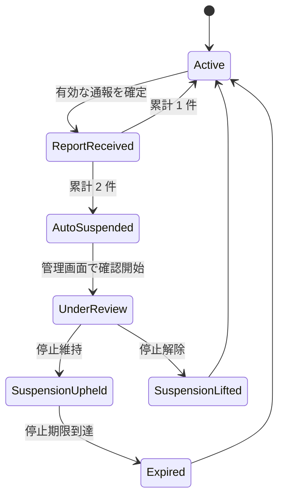

# RandomCam モデレーション・管理画面設計（初期版）

## 目的と前提

RandomCam は、登録なしで世界中の利用者をランダムに組み合わせる 1 対 1 の映像・音声チャットである。初期版は、成人であることの自己申告を必須にし、友達づくり・文化交流・言語練習だけを許可する。恋愛目的、性的な出会い、ヌードまたは性的コンテンツ、嫌がらせ、勧誘は禁止する。

運営上の最小要件は次のとおり。

- 通報時に、**通報された相手**の直近の映像フレームを証拠として保存する。
- 同一利用セッションが 2 回通報されたら、自動的に停止する。
- 運営者（一馬）のみが管理画面から証拠を確認し、停止を維持または解除できる。
- 証拠画像と関連メタデータは 30 日で自動削除する。
- 公開チャット、録画、常時の映像保存は行わない。

初期目標は数百人規模、同時接続はおおむね 30〜100 人である。映像・音声は WebRTC の P2P を優先し、Cloudflare は通報、マッチング、管理用データを扱う。

## 全体構成

| 層 | 役割 | Cloudflare サービス |
| --- | --- | --- |
| ブラウザ | 同意、WebRTC 通話、通報操作、通報時の相手映像フレームの取得 | WebRTC / Canvas API |
| シグナリング・マッチング | 匿名セッション発行、相手ペア、停止状態の照会 | Worker + Durable Object |
| モデレーション API | 通報受付、画像の署名付きアップロード発行、2 回目で停止、管理 API | Worker |
| 証拠画像 | 通報画像を非公開のD1 BLOBで保存し、期限で削除 | D1 |
| 運営データ | 通報、停止、審査判断、監査ログ | D1 |
| 管理画面 | 一馬だけが証拠を確認・判断する画面 | Worker 配下の `/admin` |

映像は通常サーバーへ送らない。通報ボタンを押した時だけ、通報者のブラウザが受信中の相手 `video` 要素を Canvas に描画して WebP 化し、短命のアップロード URL を通じてD1へ送る。このため、通報者の画面に実際に表示されていた相手映像だけが証拠対象になる。

## 匿名セッションと停止対象

### セッション

接続開始時、Worker がランダムな `session_id` を発行する。ブラウザはその値を `sessionStorage` にだけ保持し、タブを閉じれば失効する。D1 には生の識別子を置かず、サーバー側の秘密鍵で HMAC 化した `session_key` を保存・照合する。

`session_id` は匿名性を保つための短期識別子であり、本人確認ではない。ブラウザフィンガープリントを生成・保存して追跡する設計にはしない。

### 停止の現実的な範囲

匿名・登録なしでは、端末やネットワークを変えて再参加することまで完全に防ぐことはできない。初期版は「同一の有効セッションを即時停止し、同じ短期ブラウザ・セッションの再参加を抑止する」ことを最低ラインとする。

再参加抑止には、同意画面で発行するランダムな `client_install_id` を HttpOnly・Secure・SameSite=Lax Cookie に保存し、D1 には HMAC 化した値だけを保存する。これは広告追跡用の指紋ではなく、RandomCam 内での短期安全措置だけに用いるランダム識別子である。Cookie を削除した利用者まで恒久的に識別しようとはしない。

停止の初期ポリシーは **30 日間の自動停止** とする。管理者が「維持」を選んだ場合は期限を延長でき、「解除」を選んだ場合は即時に停止を取り消す。恒久停止は、本人確認や不服申立ての方針が整うまで導入しない。

## D1 データ設計

### `reports`

| 項目 | 内容 |
| --- | --- |
| `id` | UUID。通報番号 |
| `reported_session_key` | 通報された側の HMAC 化済みセッション識別子 |
| `reporter_session_key` | 通報した側の HMAC 化済みセッション識別子 |
| `match_id` | 当該 1 対 1 通話のランダム ID |
| `reason_code` | `sexual` / `nudity` / `harassment` / `solicitation` / `minor_concern` / `other` |
| `note` | 任意の短文。最大 500 文字、HTML は保存しない |
| `evidence_blob` | D1に保存する非公開のWebPバイナリ。JSONや一覧APIには含めない |
| `evidence_content_type` / `evidence_size` | `image/webp` と保存サイズ。取得時に再検査する |
| `evidence_sha256` | アップロード済み画像の整合性確認用ハッシュ |
| `captured_at` | ブラウザがフレームを取得した時刻 |
| `created_at` | Worker が通報を確定した時刻 |
| `expires_at` | 原則 `created_at + 30 日` |
| `review_status` | `pending` / `upheld` / `dismissed` / `expired` |
| `reviewed_at` | 審査時刻。未審査なら null |
| `review_note` | 管理者メモ。最大 1,000 文字 |

`reported_session_key` と `reporter_session_key` の組み合わせには、同一 `match_id` で 1 件だけという一意制約を置く。同じ会話で通報ボタンを連打して停止回数を水増しできないようにする。

### `suspensions`

| 項目 | 内容 |
| --- | --- |
| `id` | UUID |
| `subject_key` | 停止対象の HMAC 化済み識別子 |
| `subject_type` | `session` または `install` |
| `status` | `active` / `lifted` / `expired` |
| `source` | `auto_two_reports` / `admin` |
| `reason` | 停止理由の短文 |
| `started_at` / `ends_at` | 停止期間 |
| `lifted_at` / `lifted_by` | 解除情報 |

同じ対象に有効な `active` 停止は 1 件だけにする。接続・マッチング・通報 API のすべてで有効停止を確認する。

### `admin_audit_logs`

| 項目 | 内容 |
| --- | --- |
| `id` | UUID |
| `admin_id` | 固定の管理者 ID。パスワードそのものは保存しない |
| `action` | `login_success` / `login_failure` / `view_evidence` / `uphold` / `dismiss` / `lift` |
| `report_id` | 関連する通報。なければ null |
| `created_at` | 実行時刻 |
| `ip_hash` | 必要最小限の不正ログイン検知用 HMAC 値。短期保持 |

ログは操作の説明責任のため 90 日保持後に削除する。証拠画像のバイナリは監査ログに複製しない。

## 状態遷移

通報は即時に接続を切断し、通報者を待機列へ戻す。通報された側は 2 回目で停止画面へ遷移させる。1 回目は「ルール違反の通報を受けた」ことを表示せず、相手への報復や証拠隠しを誘発しない。

## API 案

すべて HTTPS のみ。公開 API は短時間の Cloudflare Turnstile トークンを要求し、レート制限する。管理 API は通常利用者の API と完全に分ける。

### 公開側

| API | 認可 | 内容 |
| --- | --- | --- |
| `POST /api/session` | 年齢自己申告 + Turnstile | 匿名セッションを開始し、停止状態を確認 |
| `POST /api/reports/upload-intent` | 有効なマッチ + session | D1保存用の1回限り・数分有効のアップロード URL を発行 |
| `PUT /api/reports/upload/:id` | 一時アップロードID | WebP形式・750 KB以下を検査し、D1の一時レコードへ非公開保存 |
| `POST /api/reports` | 有効なマッチ + session | 画像アップロード完了を検証して通報を確定。重複排除、通報数集計、2 回目なら停止 |
| `POST /api/session/end` | session | 待機列・シグナリングを終了 |

`POST /api/reports` はクライアントの自己申告だけを信頼しない。`match_id` の相手関係、アップロードIDの所有者、D1上の画像形式・容量・作成時刻を Worker 側で照合する。受理する画像はWebPのみ、最大750 KB、最大1280 px程度にブラウザ側で正規化する。サーバーはWebPシグネチャも検査し、サイズ超過を拒否する。

### 管理側

| API | 内容 |
| --- | --- |
| `POST /admin/login` | パスワード + Turnstile。成功時に短命・HttpOnly セッション Cookie を発行 |
| `POST /admin/logout` | 管理セッションを失効 |
| `GET /admin/api/reports?status=pending` | 未確認通報の一覧。画像バイナリは含めない |
| `GET /admin/api/reports/:id/evidence` | 認可後にD1のBLOBを返す。署名付き公開 URL は発行しない |
| `POST /admin/api/reports/:id/decision` | `uphold` / `dismiss` と任意メモ。停止維持または解除を原子的に実行 |

管理画面は `Cache-Control: no-store` を必須にし、証拠画像はブラウザの永続キャッシュに残さない。サムネイルを CDN キャッシュにも載せない。

## 管理画面の最小構成

1. ログイン画面: 一馬だけのパスワード、Turnstile、失敗回数制限。
2. 未確認通報一覧: 通報時刻、理由、現在の停止状態、証拠の有無。氏名・IP・国などの不要な個人情報は表示しない。
3. 通報詳細: 証拠画像を 1 枚だけ表示、理由、同一対象の有効通報数、停止期限、管理者メモ。
4. 判断操作: 「停止を維持」「停止を解除」の二択を明確にし、確認ダイアログと操作ログを残す。
5. 期限切れ: 30 日を過ぎた証拠は画像を表示せず、削除済みであることだけを示す。

管理ログインのパスワードは Cloudflare Worker Secret にのみ保存し、平文をリポジトリ、D1、ブラウザ、画面ログへ置かない。パスワード単独ではなく Turnstile とレート制限を併用する。将来的には Cloudflare Access のメール許可リストまたは FIDO2 を追加する。

## 保存・自動削除

1. 通報確定時に、一時D1レコードのWebP BLOBを通報レコードへ移す。
2. 毎日 1 回の Worker Cron Trigger で、`expires_at <= now` の通報・一時アップロードを完全削除する。画像BLOBも同じ削除に含まれる。
3. 初期版では通報レコードも30日で完全削除し、集計値だけを日次集計に残す。
4. Cron実行前でも、管理画面・画像取得 API は `expires_at` を過ぎた画像を絶対に返さない。

## セキュリティとプライバシー

- 通報画像はセンシティブ情報であり、D1 BLOBを公開しない。公開 URL、静的 URL、一覧APIへのバイナリ混入は使用しない。
- 通報者・被通報者に、相手の識別子、IP アドレス、通報内容、審査結果を開示しない。
- 通報画像に関する同意、保存目的、30 日の保持期間、管理者だけが確認することをプライバシーポリシーに明記する。
- 画像の EXIF は削除し、サーバー側で再エンコードしてから確定保存する。クライアントが送る `Content-Type` を信用しない。
- 管理ログイン、通報、マッチング開始にレート制限を設ける。管理ログインは失敗回数に応じて指数バックオフをかける。
- XSS 対策として管理メモ・通報メモはプレーンテキストで保存・表示し、HTML を描画しない。管理更新は CSRF 対策を行う。
- D1へのアクセス権はモデレーション Worker のみへ限定する。フロントエンドにAPIトークンやストレージ資格情報を置かない。
- 成人自己申告だけでは未成年利用を完全には防げない。未成年らしさの通報理由を用意し、該当時は即時停止・優先確認にする。

## 実装順序

1. **データ基盤**: D1 のテーブル、30日削除Cron、Worker Secretsを作成する。
2. **停止判定**: セッション開始・マッチング前に有効停止を確認する共通ミドルウェアを作る。
3. **通報フロー**: ブラウザで相手映像を静止画化し、アップロード意図→限定アップロード→通報確定を実装する。重複通報防止をテストする。
4. **自動停止**: 通報確定と同一トランザクションで通報件数を数え、2 回目で停止を作成し、進行中のシグナリングを終了する。
5. **管理画面**: ログイン、一覧、証拠ストリーミング、維持・解除、監査ログを実装する。
6. **削除と監視**: Cronを検証し、期限切れ画像がAPIから取得できないことをテストする。
7. **運用テスト**: 正常通報、同じ会話の連打、画像未アップロード、期限切れ、解除直後の再接続、停止中の再接続をテストする。

## 初期版で明確にしないこと

- 自動画像判定や常時監視は初期版に入れない。誤判定と費用のため、まずは利用者通報と一馬の確認で開始する。
- 恒久的な端末追跡やブラウザフィンガープリントは行わない。
- 警察・外部機関への通報手順、年齢確認の強化、不服申立て窓口は、公開前に利用規約・法的方針と合わせて別途決める。
